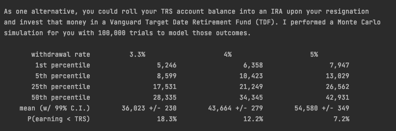
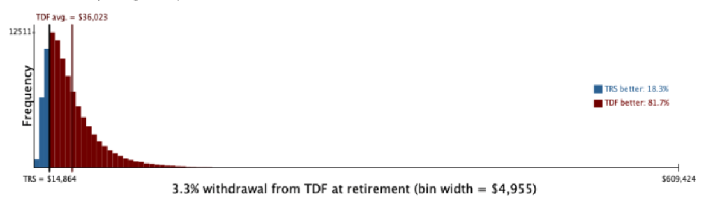
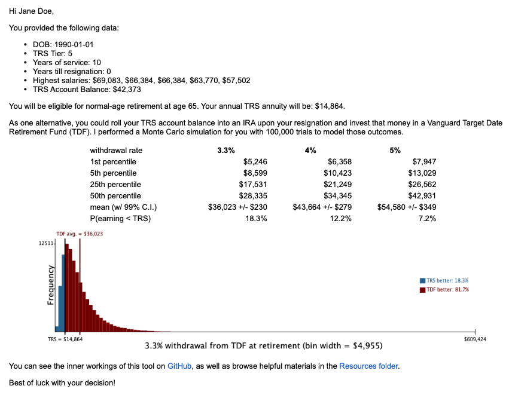

# TRS Decision Tool

## Description
This Java program is intended for vested but not yet retired 
members of the 
[Teacher's Retirement System of Texas](https://www.trs.texas.gov/Pages/Homepage.aspx) 
(TRS). With a resignation date in mind, the program computes the 
member's normal retirement benefit. However, upon resignation, TRS 
members can opt to forfeit their pension and withdraw their 
contributions. The program runs a Monte Carlo simulation (with 
100,000 trials in under five seconds on my machine) to model rolling 
that TRS account balance into an IRA and investing those funds in a 
[Vanguard Target Date Retirement Fund](https://investor.vanguard.com/investment-products/mutual-funds/target-retirement-funds)
(TDF), and it returns the probability that this strategy results in 
a lesser retirement than TRS would have.

## Requirements
TRS Members will need the following information about their account, 
which they can find on 
[MyTRS](https://mytrs.texas.gov/MbrSelfService/SSSALogin.action):
1. Years of service
2. TRS account balance
3. Top 5 (or Top 3, depending on TRS tier) highest salaries

The program can email results to TRS members. In order to utilize 
that functionality:
1. You need a Gmail account. The account settings must be correctly 
configured to allow "less secure app" connectivity. 
[This YouTube tutorial](https://www.youtube.com/watch?v=yuT6PhH-5iw) 
was helpful.
2. Your project directory must contain a plaintext file called 
`EmailCredentials.txt` that contains only two lines: first, the 
Gmail username (not including the "@gmail.com"), and second, the 
password generated for the app (see the YouTube tutorial above). 
Note: this file is not included in this repository.

## Usage

In the `main` method (in `TrsDecisionDriver.java`), either collect 
TRS member info this way:

```java 
TrsMember member = TrsMember.initializeTrsMember();
member.getTrsAccount().initializeTrsAccount();
```

Or this way:

```java 
TrsMember member = new TrsMember("Jane Doe", "janesusername@gmail.com", "01/01/1990");
member.getTrsAccount().setTier(5);
member.getTrsAccount().setYearsOfService(10);
member.getTrsAccount().setYearsTillResignation(0);
member.getTrsAccount().setHighestSalaries(new int[]{69083, 66384, 66384, 63770, 57502});
member.getTrsAccount().setAccountBalance(42373);
```

Print TRS normal retirement benefit information to the console:

```java 
System.out.println(member.getTrsAccount().normalBenefitToString());
```


Run the Monte Carlo simulation, and print the results to the console:

```java 
MonteCarloSimulation simForMember = new MonteCarloSimulation(100000, member);
System.out.println(simForMember);
```




Draw and save a histogram of Monte Carlo simulation trials:

```java 
TrsHistogram hist = new TrsHistogram(simForMember.getWithdrawalAt3pt3pct(),
        member.getTrsAccount().getNormalBenefit());
hist.draw();
StdDraw.save(TrsHistogram.HISTOGRAM_FILE_PATH);
```



Email the results:

```java 
TrsDecisionToolEmail.runSender(member, simForMember);
```



## Roadmap
This tool currently assumes that annual returns for Vanguard's 
Target Date Fund portfolios are normally distributed. Although 
this [may not be a bad assumption](https://qr.ae/prZtYV) (and
even a fairly 
[accurate one](https://www3.gmu.edu/schools/vse/seor/studentprojects/graduate/2014Spring/FinancialEngineering/Report.pdf?gmuw-rd=sm&gmuw-rdm=ht))
for these purposes, the consensus seems to be that (even annual) 
asset return distributions are 
[fat-tailed](https://en.wikipedia.org/wiki/Fat-tailed_distribution)
(sources: 
[A](https://towardsdatascience.com/are-stock-returns-normally-distributed-e0388d71267e), 
[B](https://klementoninvesting.substack.com/p/the-distribution-of-stock-market),
[C](https://jai.pm-research.com/content/12/3/8)). In future, I'd 
like to allow users to choose to run this simulation using an 
appropriate fat-tailed distribution, which would increase the 
probabilities of large negative annual returns in particular.

## Acknowledgments
The `StdDraw.java` class is borrowed from
[Sedgewick and Wayne's *Introduction to Programming in Java* course](http://introcs.cs.princeton.edu/java). 
They also have a `Histogram.java` class, which was helpful for 
writing my own `TrsHistogram.java` class.

## References
All references, as well as additional resources for TRS members, 
are saved as PDFs in the Resources folder.